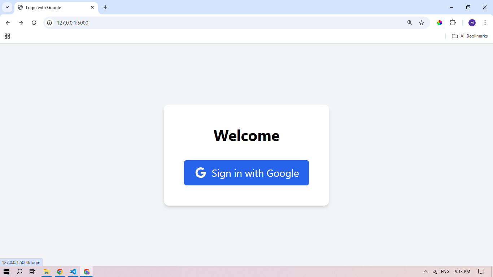

# Flask Google OAuth Login

A Flask application implementing Google OAuth 2.0 authentication.



## Setup

1. Clone the repository
```bash
git clone https://github.com/mohitsha888/login-with-socialmedia
cd login-with-socialmedia
